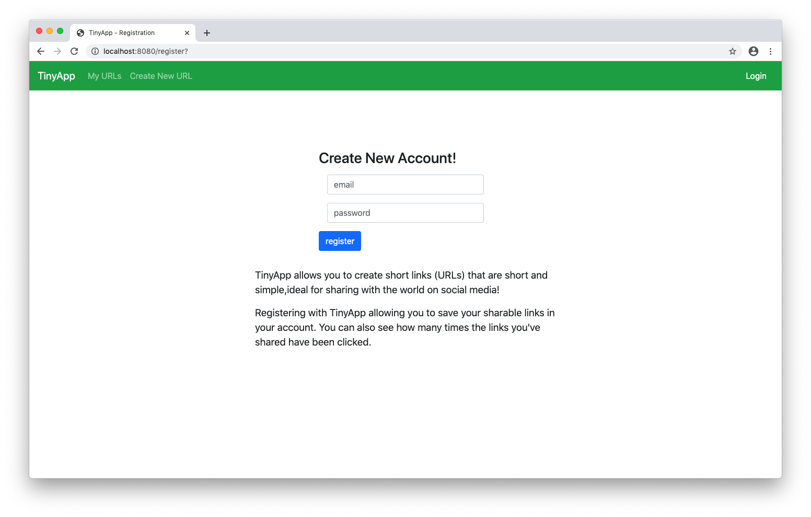

# TinyApp

TinyApp is a simple and easy to use link(URL) shortener application similar to bitly.com and goo.gl. Creating short links allows you to share them more easily with friends and family. By signing up with TinyApp, you can save the links you create so you always have access to them. The links you create track the number of times your shared links have been clicked on.

TinyApp is a full stack web application built using [Node.js](https://nodejs.org) and [Expressjs](https://expressjs.com/)node.js framework for the back-end server, HTML, [EJS](https://ejs.co/) Embeded javaScript Templates and the [Bootstrap](https://getbootstrap.com/) toolkit for the front-end. The databases are simple [JSON](https://json.org/) files. The server file uses the built-in node package [File System (fs)](https://nodejs.org/api/fs.html) to read and write the user profiles and the URLs.

The [bcrypt.js](https://www.npmjs.com/package/bcrypt) node module is used during the user registration process to hash the password. this way, the passwords are never stored in plain text, insuring security for the end user. The server also uses an Expressjs middleware called [cookie-session](https://expressjs.com/en/resources/middleware/cookie-session.html). Cookie-session only stores a session identifier on the client within a cookie.

## Screenshots

### Registration


### Login


### Create a new short URL


### Show a URL


### User index/home


## Getting Started

In order to use TinyApp, you must first clone the project to your local machine.

Once the project is cloned, head over to your bash terminal and isntall the dependencies (listed below) using the following command:

```
npm install <module name>
```

Once all the dependencies are installed, type the following command:

```
node express_server.js
```

You should get a message saying:
```
tiny-app listening on port 8080
```

Now head over to your web browser of choice <em>cough [FireFox](https://www.mozilla.org/en-US/firefox/new/) cough</em> and navigate to <localhost:8080/register>.

Now simply create an account and start shortening some URLs and share then with the world!

Alternatively, you can use ol' Joe's credentials to see what he's got going on with his links.

##### (`joe@gmail.com`, 123456)


to share links, copy the "Shareable link".

enjoy!

## Dependencies

These are the modules needed to run TinyApp:

- [node.js](https://nodejs.org)
- [fs](https://nodejs.org/api/fs.html)
- [express](https://expressjs.com/)
- [body-parser](https://www.npmjs.com/package/body-parser)
- [bcrypt](https://www.npmjs.com/package/bcrypt)
- [cookie-session](https://expressjs.com/en/resources/middleware/cookie-session.html)

